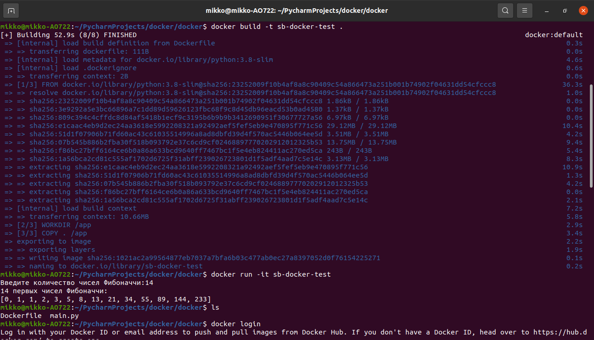

# Практическая работа 5.
## 1. Установка. 
Установка делалась согласно уроку и оф. документации. Проблем не возникло.

## 2. Разработка программы. Создание репозитория.
В качестве тестовой программы написал вычисление первых N чисел Фибоначчи. N вводит пользователь.
Этот этап также затруднений не вызвал.

## 3. Создание Docker-образа.

