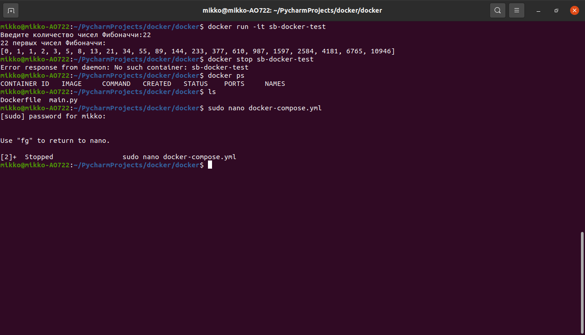

# Практическая работа 5.
## 1. Установка. 
Установка делалась согласно уроку и оф. документации. Проблем не возникло.

## 2. Разработка программы. Создание репозитория.
В качестве тестовой программы написал вычисление первых N чисел Фибоначчи. N вводит пользователь.
Этот этап также затруднений не вызвал.

## 3. 4. Создание Docker-образа. Тестирование.
Скриншот сборки контейнера и запуск приложения в нем. Все работает. 

Дополнительно залил контейнер на Docker hub.
Сразу не получилось - пришлось вернуться к уроку. Забыл сделать docker tag.

Далее запустил контейнер - приложение работает.

## 5. Docker compose

